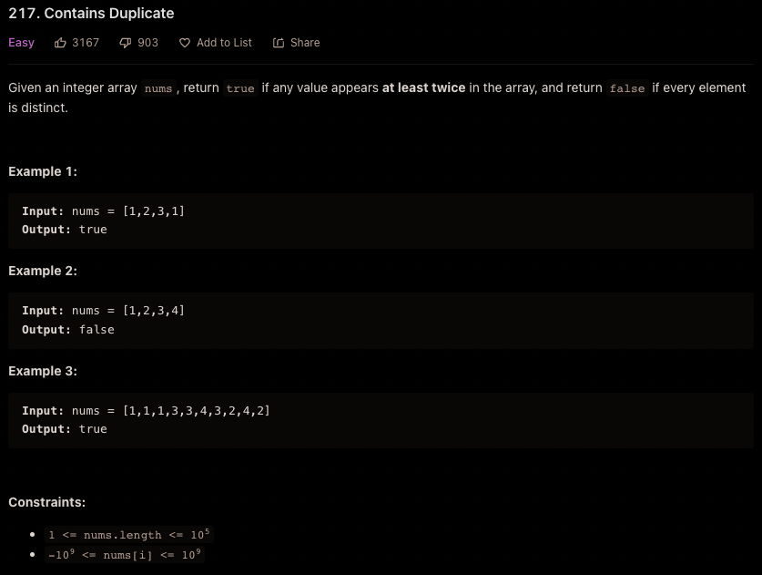

### **217. Contains Duplicate**



## Set

Space: O(n)

Time: O(n)

```cpp
class Solution {
public:
    bool containsDuplicate(vector<int>& nums) {
        unordered_set<int> numSet;   
        for(auto num: nums) {
            if(!hasNum(numSet, num)) {
                numSet.insert(num);
            } else {
                return true;
            }
        }
        
        return false;
    }

private:
    bool hasNum(unordered_set<int> const& uSet, int num) {
        return uSet.find(num) != uSet.end();
    }
};
```

## Sorting

Space: O(1)
Time: O(nlogn)
```cpp
class Solution {
public:
    bool containsDuplicate(vector<int>& nums) {
        sort(nums.begin(), nums.end());
        
        for(int i = 0; i < nums.size() - 1; ++i) {
            if(nums[i] == nums[i + 1]) {
                return true;
            }
        }
        
        return false;
    }
};


```