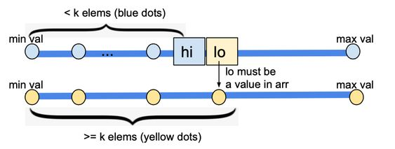

# 378. Kth Smallest Element in a Sorted Matrix

## Heap
```cpp
class Solution {
public:
    int kthSmallest(vector<vector<int>>& matrix, int k) { 
        priority_queue<int> pq;
        
        for(int i = 0; i < matrix.size(); ++i) {
            for(int j = 0; j < matrix[0].size(); ++j) {
                pq.push(matrix[i][j]);
                
                if(pq.size() > k) {
                    pq.pop();
                }
            }
        }
        
        return pq.top();
    }
};
```
## Binary Search




```cpp
class Solution {
public:
  int kthSmallest(vector<vector<int>>& matrix, int k) {
    int low = matrix.front().front();
    int high = matrix.back().back();
    
      while(low <= high) {
          int mid = low + (high - low) / 2;          
          if(getLessOrEqualCount(matrix, mid) >= k) {
              high = mid - 1;
          } else {
              low = mid + 1;
          }
      }
     
      return low;
  }
    
    
private:
    int getLessOrEqualCount(vector<vector<int>>& matrix, int value) {
        int count = 0;

        int n = matrix.size();
        int r = n - 1;
        int c = 0;
        while (r >= 0 && c < n) {
            if (value >= matrix[r][c]) {
              c++;
              const int tempRowSize = r + 1;
              count += tempRowSize;
            } else {
              r--;
            }
        }
        z
      return count;
    }
};

```